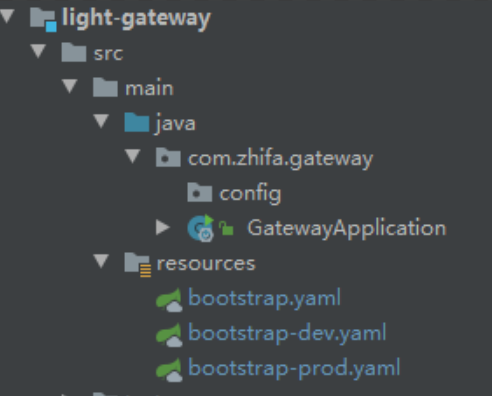
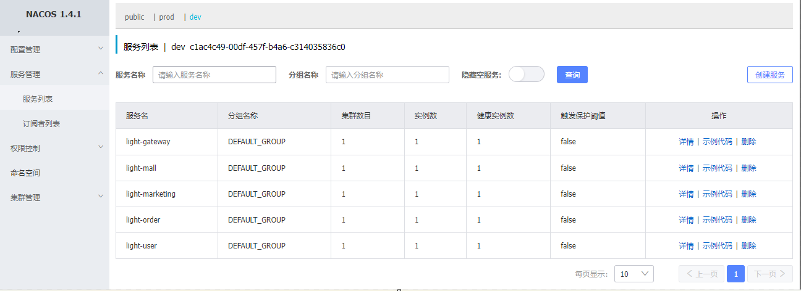

## Nacos简介

Nacos：Dynamic Naming and Configuration Service，翻译为动态命名和配置服务。

Nacos 是阿里巴巴推出来的一个新开源项目，这是一个更易于构建云原生应用的动态服务发现、配置管理和服务管理平台。

[Nacos官网](https://nacos.io/zh-cn/index.html)

[Spring Cloud阿里巴巴参考文档 ：Spring Cloud Alibaba Reference Documentation](https://spring-cloud-alibaba-group.github.io/github-pages/greenwich/spring-cloud-alibaba.html)

Nacos 支持如下核心特性：

- **服务发现**： 支持 DNS 与 RPC 服务发现，也提供原生 SDK 、OpenAPI 等多种服务注册方式和 DNS、HTTP 与 API 等多种服务发现方式。
- **服务健康监测**： Nacos 提供对服务的实时的健康检查，阻止向不健康的主机或服务实例发送请求。
- **动态配置服务**： Nacos 提供配置统一管理功能，能够帮助我们将配置以中心化、外部化和动态化的方式管理所有环境的应用配置和服务配置。
- **动态 DNS 服务**： Nacos 支持动态 DNS 服务权重路由，能够让我们很容易地实现中间层负载均衡、更灵活的路由策略、流量控制以及数据中心内网的简单 DNS 解析服务。
- **服务及其元数据管理**： Nacos 支持从微服务平台建设的视角管理数据中心的所有服务及元数据，包括管理服务的描述、生命周期、服务的静态依赖分析、服务的健康状态、服务的流量管理、路由及安全策略、服务的 SLA 以及最首要的 metrics 统计数据。

## 单机部署

### 解压nacos到/opt目录下

[官网下载地址](https://github.com/alibaba/nacos/tags)

```
tar -xvf nacos-server-1.4.1.tar.gz -C /opt
```

### mysql创建nacos数据库，将/opt/nacos/nacos-mysql.sql 文件导入其中

### 编辑配置文件application.properties

```properties
spring.datasource.platform=mysql
db.num=1

db.url.0=jdbc:mysql://127.0.0.1:3306/nacos?characterEncoding=utf8&connectTimeout=1000&socketTimeout=3000&autoReconnect=true&useUnicode=true&useSSL=false&serverTimezone=UTC
db.user.0=nacos
db.password.0=123456

db.pool.config.connectionTimeout=30000
db.pool.config.validationTimeout=10000
db.pool.config.maximumPoolSize=20
db.pool.config.minimumIdle=2
```

### 单机模式启动

```bash
cd /opt/nacos/bin/

sh startup.sh -m standalone
```

### 进入系统

`http://192.168.137.10:8848/nacos`
`用户名/密码: nacos/nacos`

## 集群部署

—-微服务部署篇再续

## pom包引入

- 服务注册中心

```xml
## 父项目light-cloud的pom文件中,引入cloud-alibaba全家桶
<dependency>
  <groupId>com.alibaba.cloud</groupId>
  <artifactId>spring-cloud-alibaba-dependencies</artifactId>
  <version>${cloud-alibaba.version}</version>
  <type>pom</type>
  <scope>import</scope>
</dependency>
## light-base-dependencies的pom文件中,引入 Nacos Discovery 进行服务注册/发现
<dependency>
  <groupId>com.alibaba.cloud</groupId>
  <artifactId>spring-cloud-starter-alibaba-nacos-discovery</artifactId>
</dependency>
```

- 服务配置中心
```xml
## light-base-dependencies的pom文件中,引入 Nacos config 配置中心
<dependency>
  <groupId>com.alibaba.cloud</groupId>
  <artifactId>spring-cloud-starter-alibaba-nacos-config</artifactId>
</dependency>
```
## 配置文件

在gateway以及各个biz模块,新建启动类和配置文件:

  


-  启动类

```java
@SpringBootApplication
    @EnableDiscoveryClient
    public class GatewayApplication {
        public static void main(String[] args) {
            SpringApplication.run(GatewayApplication.class, args);
        }
    } 
```
 

-  bootstrap.yaml

```yaml
server:
  port: 7499
spring:
  application:
    name: light-gateway  #服务名称
  cloud:
    nacos:
      discovery:
        server-addr: 192.168.137.10:8848  #Nacos 链接地址
  profiles:
    active: dev
```
 

-  bootstrap-dev.yaml和bootstrap-prod.yaml
```yaml
spring:
  cloud:
    nacos:
      discovery:
        server-addr: 192.168.137.10:8848  #Nacos 链接地址
        namespace: c1ac4c49-00df-457f-b4a6-c314035836c0 #Nacos 命名空间ID
      config:
        server-addr: ${spring.cloud.nacos.discovery.server-addr}  #Nacos 链接地址
        namespace: ${spring.cloud.nacos.discovery.namespace} #Nacos 命名空间ID
        group: DEFAULT_GROUP  # 默认分组就是DEFAULT_GROUP，如果使用默认分组可以不配置
        file-extension: yaml   #默认properties
        # 公共配置
        shared-configs[0]:
          data-id: light-common-dev.yaml #各模块公共配置
          refresh: true
```
 

-  依次启动,查看nacos管理页面-服务列表可以发现已经全部注册上了  
  

## QA
###  Q:为什么要将服务注册到Nacos以及其实现 
###  Q:负载均衡设计及其实现 
###  Q:配置管理模型 
###  Q:什么是公共配置,优先级如何 
