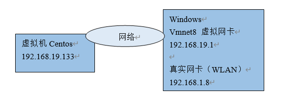
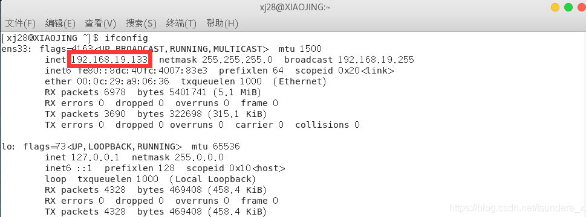
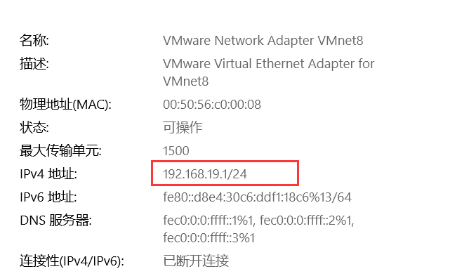
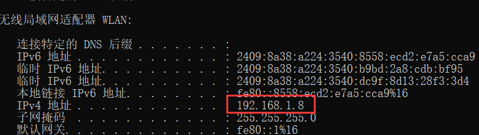
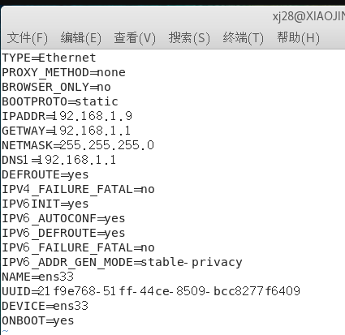
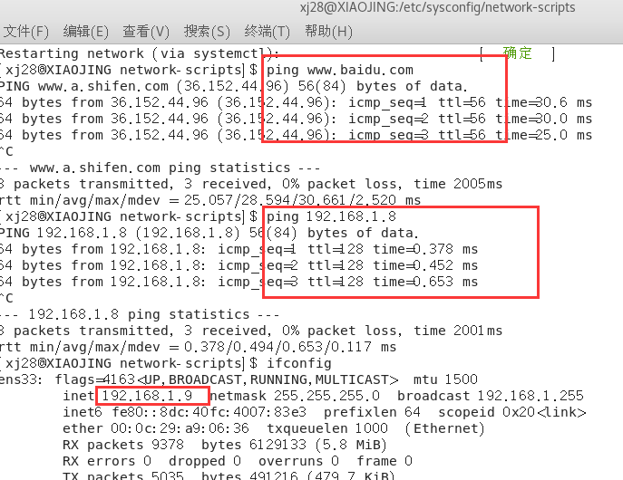
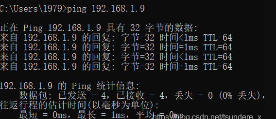

### NAT 模式

相当于宿主机再构建一个局域网，虚拟机无法和本局域网中的其他真实主机进行通讯。只需要宿主机器能访问互联网，那么虚拟机就能上网，不需要再去配置 IP 地址，子网掩码，网关。虚拟机和主机能够互相 ping 通。
  

  

  

  

### 桥接模式

VMWare虚拟出来的操作系统就像是局域网中的一台独立的主机，它可以访问网内任何一台机器。但是需要我们手动去配置 IP 地址和网关，IP 地址要与主机的无线网的 IP 段对应，子网掩码，网关，DNS 都需要与宿主机保持一致。下面是我将虚拟机从 NAT 模式换成桥接模式对配置文件做的一些改动，重启网络后，虚拟机可以访问自身静态 IP，访问公网，宿主机和虚拟机也可以相互 ping 通。
  

  

  

[https://blog.csdn.net/tsundere_x/article/details/105577661](https://blog.csdn.net/tsundere_x/article/details/105577661)

### VMware 桥接模式
VMware桥接模式，也就是将虚拟机的虚拟网络适配器与主机的物理网络适配器进行交接，虚拟机中的虚拟网络适配器可通过主机中的物理网络适配器直接访问到外部网络(例如图中所示的局域网和Internet，下同)。简而言之，这就好像在上图所示的局域网中添加了一台新的、独立的计算机一样。因此，虚拟机也会占用局域网中的一个IP地址，并且可以和其他终端进行相互访问。桥接模式网络连接支持有线和无线主机网络适配器。如果你想把虚拟机当做一台完全独立的计算机看待，并且允许它和其他终端一样的进行网络通信，那么桥接模式通常是虚拟机访问网络的最简单途径。

### VMware NAT模式
NAT，是Network Address Translation的缩写，意即网络地址转换。NAT模式也是VMware创建虚拟机的默认网络连接模式。使用NAT模式网络连接时，VMware会在主机上建立单独的专用网络，用以在主机和虚拟机之间相互通信。虚拟机向外部网络发送的请求数据"包裹"，都会交由NAT网络适配器加上"特殊标记"并以主机的名义转发出去，外部网络返回的响应数据"包裹"，也是先由主机接收，然后交由NAT网络适配器根据"特殊标记"进行识别并转发给对应的虚拟机，因此，虚拟机在外部网络中不必具有自己的IP地址。从外部网络来看，虚拟机和主机在共享一个IP地址，默认情况下，外部网络终端也无法访问到虚拟机。 此外，在一台主机上只允许有一个NAT模式的虚拟网络。因此，同一台主机上的多个采用NAT模式网络连接的虚拟机也是可以相互访问的。 前面我们已经提到，默认情况下，外部网络无法访问到虚拟机，不过我们也可以通过手动修改NAT设置实现端口转发功能，将外部网络发送到主机指定端口的数据转发到指定的虚拟机上。比如，我们在虚拟机的80端口上"建立"了一个站点，只要我们设置端口转发，将主机88端口上的数据转发给虚拟机的80端口，就可以让外部网络通过主机的88端口访问到虚拟机80端口上的站点。

### VMware 仅主机模式
仅主机模式，是一种比NAT模式更加封闭的的网络连接模式，它将创建完全包含在主机中的专用网络。仅主机模式的虚拟网络适配器仅对主机可见，并在虚拟机和主机系统之间提供网络连接。相对于NAT模式而言，仅主机模式不具备NAT功能，因此在默认情况下，使用仅主机模式网络连接的虚拟机无法连接到Internet(在主机上安装合适的路由或代理软件，或者在Windows系统的主机上使用Internet连接共享功能，仍然可以让虚拟机连接到Internet或其他网络)。

在同一台主机上可以创建多个仅主机模式的虚拟网络，如果多个虚拟机处于同一个仅主机模式网络中，那么它们之间是可以相互通信的；如果它们处于不同的仅主机模式网络，则默认情况下无法进行相互通信(可通过在它们之间设置路由器来实现相互通信)。

在网上看到这么一段形象的比喻 ,抄袭如下http://www.softown.cn/post/13.html

（1）桥接模式的虚拟机，就像一个在路由器"民政局"那里"上过户口"的成年人，有自己单独的居住地址，虽然和主机住在同一个大院里，但好歹是有户口的人，可以大摇大摆地直接和外面通信。

（2）NAT模式的虚拟机，纯粹就是一个没上过户口的黑户，路由器"民政局"根本不知道有这么个人，自然也不会主动和它通信。即使虚拟机偶尔要向外面发送点的信件，都得交给主机以主机的名义转发出去，主机还专门请了一位叫做NAT的老大爷来专门负责这些虚拟机的发信、收信事宜。

（3）仅主机模式的虚拟机，纯粹是一个彻彻底底的黑奴，不仅没有户口、路由器"民政局"不知道这么号人，还被主机关在小黑屋里，连信件也不准往外发。

其中这个仅主机模式能够保障我们在拔掉网线的情况下继续连接我们的虚拟机，不依靠公网连接，而是依靠物理机和虚拟机的关系连接。在断网的情况下，利用这个模式，我们可以继续连接虚拟机，实现我们的操作。
