## 0 前言

网上有好多 VMware 的网络配置教程，各个方法都不一样，新人往往云里雾里，本人亦深受其害，偶尔成功一次，也不明白原理，下一次照样犯错，故记录。

## 1 想要达成的效果

主机和虚拟机之间，可以互相 ping 通，若主机可以上网，则虚拟机亦可以正常连接网络。

**注：** 与当前主机处于同一个局域网的其他主机是不能访问当前主机上的虚拟机的。

## 2 准备工作

### **2.1 开启 ping 回应**

win10 默认是不开启 ping 回应的，要设置为开启状态。
步骤：控制面板 - Windows Defender 防火墙 - 左侧的 高级设置 - 入站规则，在列表中搜索：
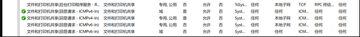  

在这两项上，右键 - 启用规则，之后一路确定。

### **2.2 主机 IP**

在主机上，win+r，打开运行，输入 cmd，打开命令行，输入 ipconfig，显示如下：

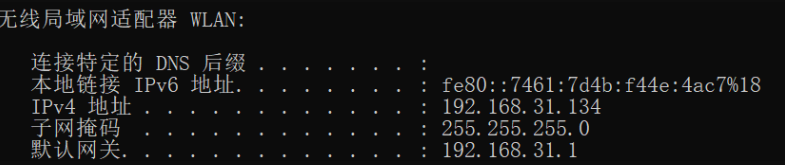  

我主机是笔记本，连接的是无线网，因此选择无线局域网适配器，如果连接的是有线网，就选择以太网适配器。
记住主机 IP 地址，以我为例，是 192.168.31.134。

## 3 安装 VMware，安装操作系统

网上有现成的安装教程，很简单,不赘述了

## 4 原理

在实现之前，得先说一下 NAT 的原理，从根本上理解。
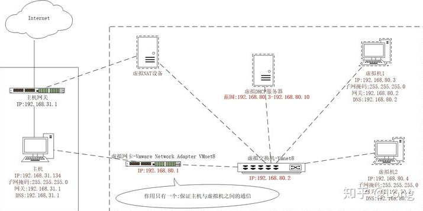  

图 1 NAT - 网络拓扑结构图

先记住这个拓扑图，后面的设置都是按照这个图来的。
虚拟机的 IP 都是由虚拟交换机决定的，由虚拟 NAT 负责连接外网，而虚拟网卡 VMware Network Adapter Vmnet8 只是负责主机与虚拟机之间的通信。

## 5 NAT 网络配置

打开 VMware Workstation Pro，选择虚拟机的网络连接类型，新建虚拟机，一般默认就是 NAT 模式，之后确定，返回主页面：
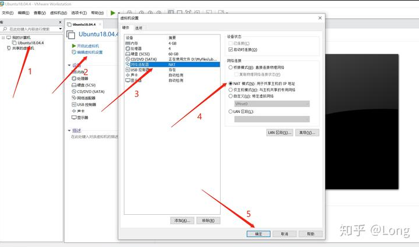  

选择编辑 - 虚拟网络编辑器，单击更改设置：
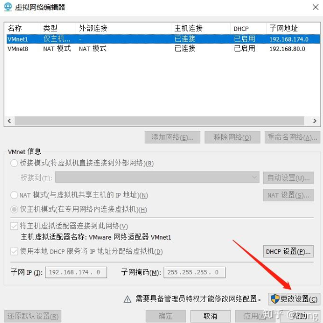  


按照箭头指向，勾选对应内容：
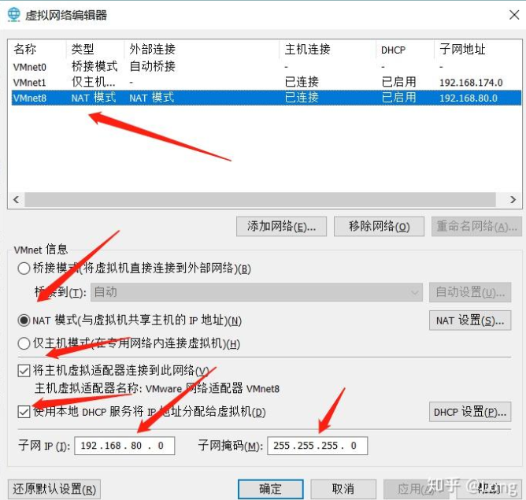  

注意下面的子网 IP，前两部分必须和主机 IP 的前两部分一样，即 192.168，第三部分得不一样，不能是 31，这里填 80，第四部分补 0。子网掩码都是 255.255.255.0，填写完毕后，点击 NAT 设置：
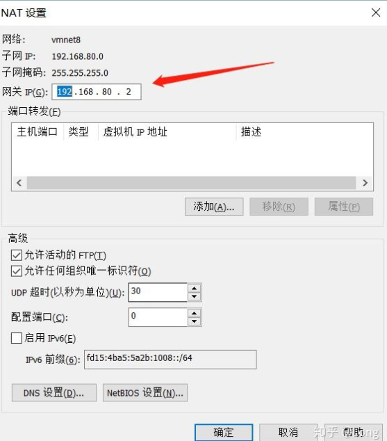  

填入网关 IP，前三部分，即网段必须是 192.168.80，和前面保持一致，第四部分随意，这里填 2，网关 IP 整体就是 192.168.80.2，**图 1 中的虚拟交换机 IP**就是这里的网关 IP，点击确定后返回，再点击 DHCP 设置：
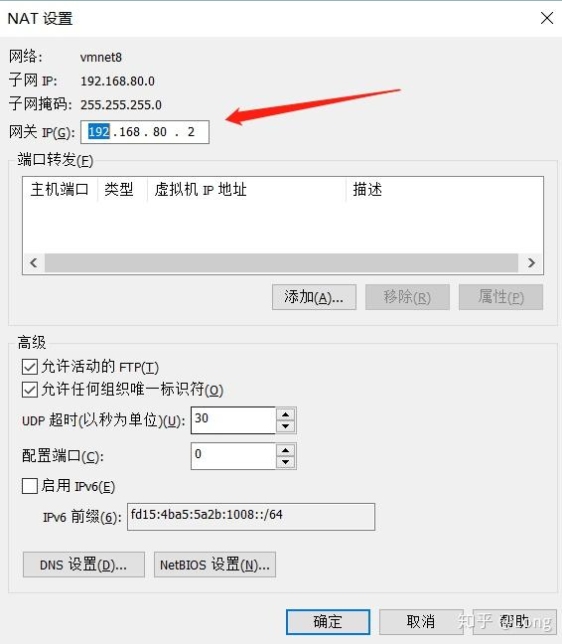  

注意起始和结束的 IP 网段也必须是 192.168.80，这个范围不要包括网关 IP：192.168.80.2，**图 1 中的虚拟 DHCP 服务器**设置完成，之后一路确定，NAT 网络设置结束。（如果 NAT 模式下，有很多台虚拟机，就把这个范围扩大）

## 6 测试

开启虚拟机，Ubuntu 默认的 IP 设置是自动获取，不需要更改，当然设置静态 IP 也是可以的，参照图 1 即可。此时 Ubuntu 是可以正常连接外网的。
接下来测试图 1 中的虚拟网卡作用，在主机上，win+q，打开搜索框，输入 网络连接，回车，打开网络连接面板：
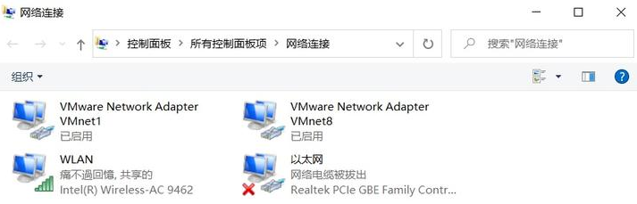  


这里的 VMware Network Adapter Vmnet8 就是**图 1 中的虚拟网卡**，另外三个分别是主机的无线网卡、主机的有线网卡、VMware 仅主机模式的虚拟网卡。右击 Vmnet8，选择属性：
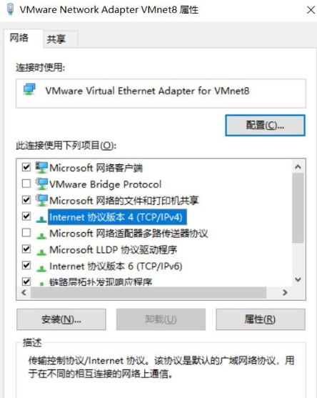  

选择 IPV4，点击属性：
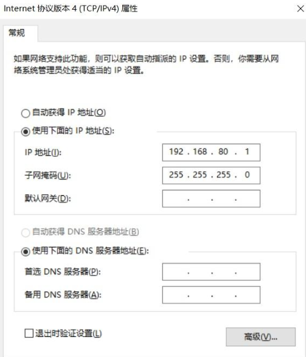  


可以选择自动获取，也可以手动设置，注意，手动的话，IP 不能和虚拟网关 IP 一样，即不能是 192.168.80.2，之后一路确定，设置完成。
在 Ubuntu 终端和 win10 命令行中，互相 ping 各自的 IP 地址，然后在虚拟网卡 Vmnet8，右键 - 禁用，在互相 ping 各自的 IP 地址，体会前后的区别。

## 7 总结

自己动手设置几次，配合图 1 的拓扑结构图，真正的理解了。

VMware Network Adapter Vmnet8 的作用是联通主机与虚拟机，有心的话，当在主机上 ssh 虚拟机时，会发现虚拟机上显示的 IP 来源（W 命令），就是 VMware Network Adapter Vmnet8 的地址，而不是主机上的（有线网卡、无线网卡）地址。

## 8 问题

遇到的其余问题：

1. 有的教程提到，需要把主机的正在使用的网卡，与 VMnet8 共享，经过测试，在 NAT 模式下，这是多余的。

2. 有时候，本来可以互相 ping 通的，突然间主机 ping 不通虚拟机了，而虚拟机可以正常联网，可以 ping 主机，这时候，问题就出在 VMware Network Adapter Vmnet8 了，默认是自动获取 IP 地址，右键禁用后，再启用，一般就可以解决问题。如果还不行的话，就设置 VMware Network Adapter Vmnet8 的静态 IP，与虚拟机同网段，问题就解决了。

**注 1**：

只要虚拟机可以正常上外网，VMware 和虚拟机的网络设置就没有问题。

**注 2**：

在实际情况中，第二个问题**极其常见**，经常是虚拟机一段时间不用了，再打开，主机就 ping 不通虚拟机，也 ssh 连接不上，这种情况 99% 都是 VMware Network Adapter Vmnet8 的 IP 和虚拟机 IP 不在同一个网段导致的；

VMware Network Adapter Vmnet8 的 IP 如果没有设置静态 IP 的话，其 IP 地址随着主机开关机是会变化的。当虚拟机启动后，禁用，然后在启用，就会自动设置同网段 IP 了。

**注 3**：

如果设置 VMware Network Adapter Vmnet8 的静态 IP，注意一下网段，要是和主机网卡的 IP 段一样，比如无线，会导致网络连接不上。（本人教训啊，手机连接 wifi 没有问题，笔记本就是连不上，折腾了好长时间，才想起来设置的静态 IP，冲突）

## 9 参考

> [https://blog.csdn.net/w_j_r/article/details/81290995](https://blog.csdn.net/w_j_r/article/details/81290995) 
> 
> [https://www.cnblogs.com/linjiaxin/p/6476480.html](https://www.cnblogs.com/linjiaxin/p/6476480.html)

## 10 更新：如何设置静态 IP？

- Ubuntu Server 下，18.04 和 20.04：

  `sudo vi /etc/netplan/00-installer-config.yaml`

- 原来的是自动获取 IP 的，可以备份一下，不备份也可以

- 清空数据

  `:%d`

- 写入下面内容

```
network:
  version: 2
  renderer: networkd
  ethernets:
    ens33:   #配置的网卡名称，自己根据情况修改
      dhcp4: no    #dhcp4关闭
      dhcp6: no    #dhcp6关闭
      addresses: [192.168.80.6/24]   #设置本机IP及掩码，注意网段，80，必须和前面一样
      gateway4: 192.168.80.2   #设置网关，这个实际上就是那个虚拟交换机的
      nameservers:
          addresses: [192.168.80.2]   #设置DNS，和gateway4设置的一样即可，不需要设为8.8.8.8

```

- 保存退出

  `:wq`

- 启用

  `sudo netplan apply`

- 看一下效果
  
  `ifconfig`

  `ping 1.cn`


Ubuntu 桌面版的静态 IP 设置，直接在网络设置那块改就行了，子网掩码是 255.255.255.0，和 ip/24 的效果是一样的。
[https://zhuanlan.zhihu.com/p/130984945](https://zhuanlan.zhihu.com/p/130984945)

